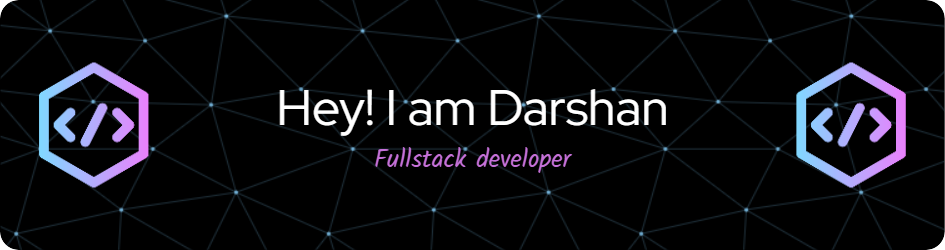

<!-- Header Section -->

  Hi 👋, I'm Darshan Godase
   
  
</h1>

<h3 align="center">A passionate FullStack Developer from India</h3>

  

<!-- GIF Image -->

- 🔭 I’m currently working on **Anonymous project**

- 🌱 I’m currently learning **Web Development**

- 📝 I regularly write articles on [BlogBreeze](https://blogbreeze-app.netlify.app/)

- 📫 How to reach me: **darshangodase10@gmail.com**

- ⚡ Fun fact: **Nothing**

---
### 🌟 Connect with Me 🌟

  
  
  
  
  
  

---
### 🏆GitHub Trophies

---
### 💻 **Technologies & Tools**

#### **Frontend**

#### **Backend**

#### **Database**

#### **Version Control**

#### **Languages**

---

### 📊 GitHub Stats

  

  

  

---
### ✍️Random Dev Quote

---

